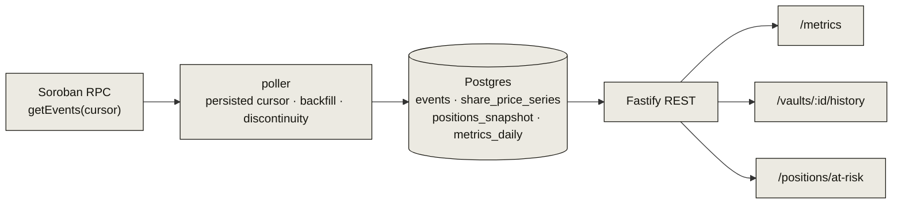

# Indexer API

The indexer tails Soroban events with a persisted cursor, writes them to Postgres,
and serves a small REST surface for the stats page, historical charts, and
at-risk-position monitoring.



## Endpoints

| Method | Path | Returns |
|---|---|---|
| `GET` | `/health` | `{ ok: true }` |
| `GET` | `/metrics` | latest TVL, utility ratio, cap utilization, borrow liquidity |
| `GET` | `/vaults/:id/history` | `share_price` series for charting |
| `GET` | `/positions/at-risk` | positions with `health_factor` near/below 1 |

## Poller

- **Persisted cursor** — resumes exactly where it stopped; survives restarts.
- **Filter** — `getEvents({ filters: [{ type: "contract", contractIds: […] }] })`
  across all Leontief contracts (no topic filter, so no event is missed).
- **Risk math is pure** — `computeAtRisk` / `healthFactor` are pure functions with
  their own unit tests, independent of I/O.

## Run it

```bash
# migrate + serve
DATABASE_URL=postgres://…  pnpm --filter @leontief/indexer migrate
DATABASE_URL=postgres://…  pnpm --filter @leontief/indexer start
```

The indexer is optional for the dApp (which reads chain state directly); it powers
aggregate history and the public [stats](https://app.leontief.tech/stats) view. A
separate `services/monitor` watches the live contracts directly and alerts on
share-price steps, oracle staleness/halts, cap utilization, and pauses.
