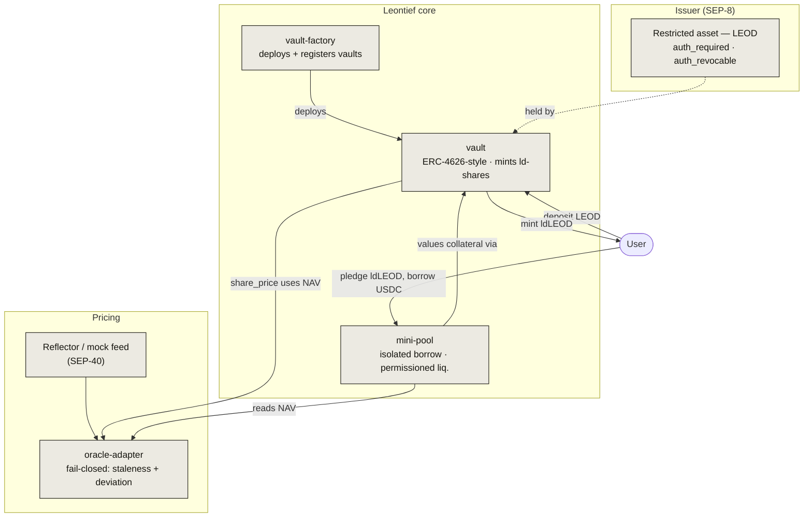
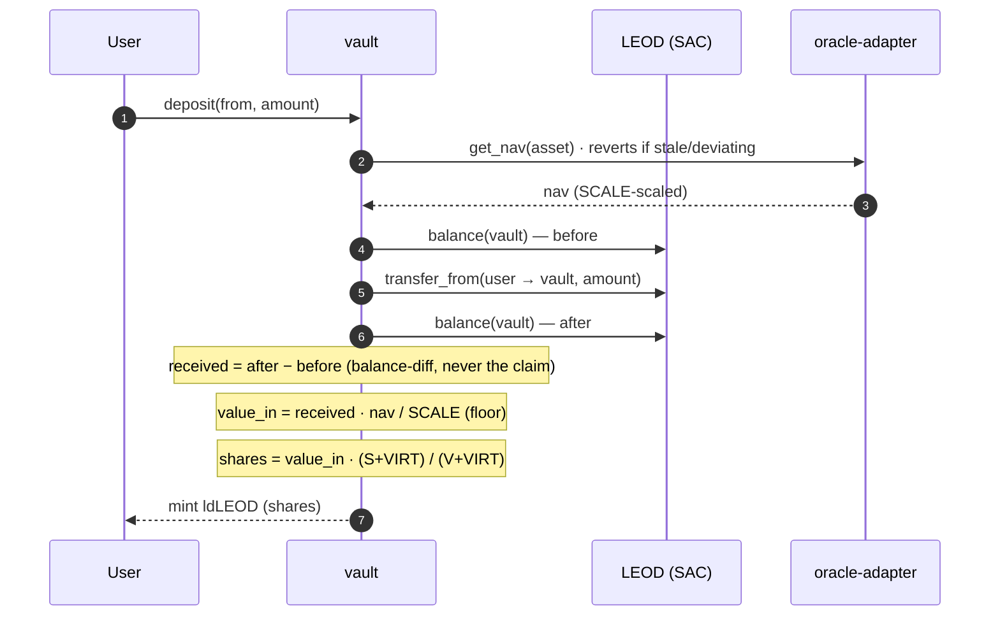
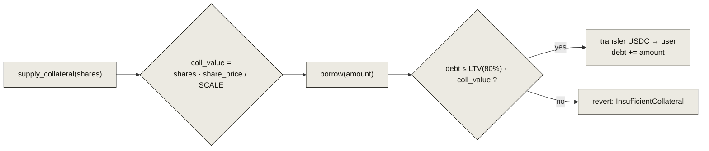
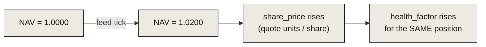
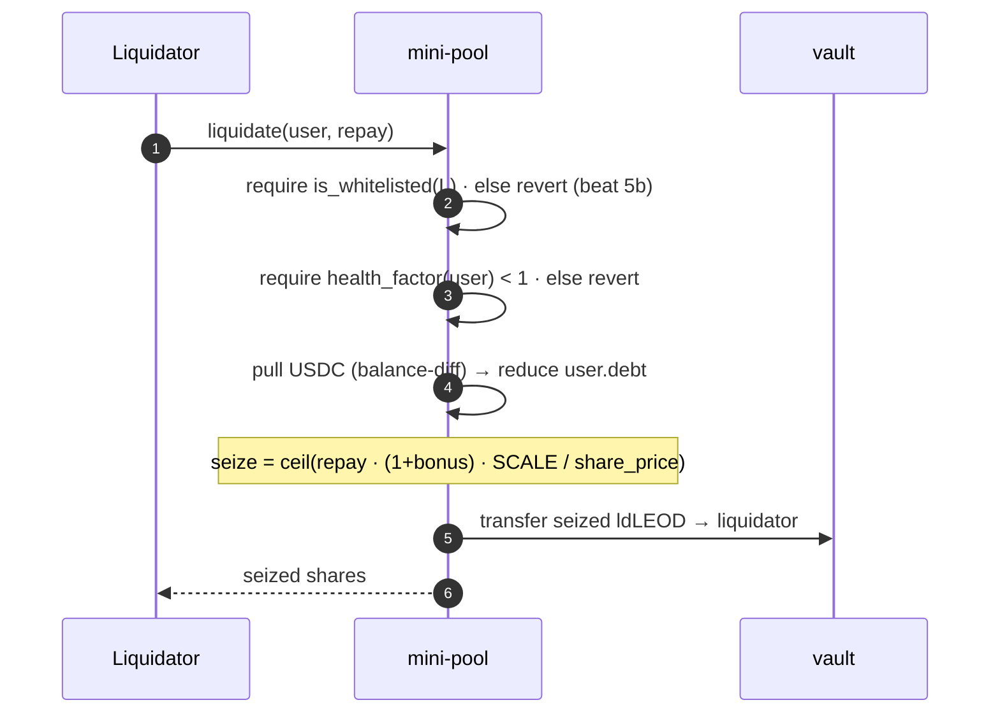
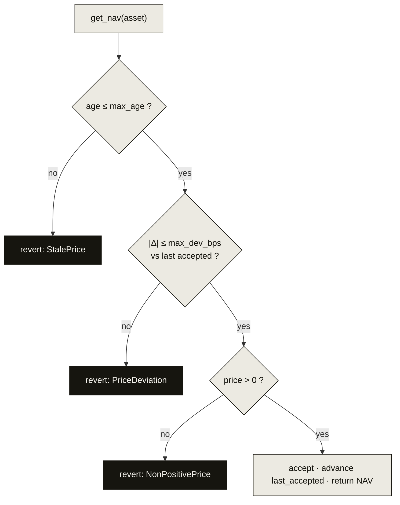

# Architecture

Leontief is five small Soroban contracts with sharp responsibilities. Nothing
trusts a caller-supplied amount; every transfer-in is measured by balance
difference; every price is checked before use and the system **fails closed**
when it can't be.

## Contract graph

| Contract | Storage it owns | Responsibility |
|---|---|---|
| `vault-factory` | registry (persistent) | Deploy vaults from a pinned wasm hash; keep the canonical registry. |
| `vault` | balances, positions (persistent); config/admin (instance) | Wrap/unwrap the RWA into `ld-shares`; SEP-41 token surface; `share_price` in quote units. |
| `mini-pool` | positions, whitelist (persistent) | Isolated USDC borrow against pledged shares; health factor; permissioned liquidation. |
| `oracle-adapter` | feed config, last-accepted (persistent) | Normalize a SEP-40 feed to a SCALE-scaled NAV; enforce staleness + deviation; **fail closed**. |
| `mock-oracle` | price (instance) | Testnet-only SEP-40 stand-in so drills don't depend on external infra. |

Storage discipline is a hard rule: **instance** storage holds only config/admin,
**persistent** holds balances/positions/registry, **temporary** holds nothing
user-owned. Every persistent write path calls `extend_ttl`.

## Flow 1 · Wrap (deposit → mint)

The vault never trusts the amount a caller claims to have sent. It measures its
own balance before and after the transfer-in and mints against the **measured**
delta, valued at the current fail-closed NAV.

Rounding always favors the protocol over the user (floor on mint), and a
**virtual offset** (`VIRT = 10³` on both legs) neutralizes the classic
first-depositor inflation attack. See [The vault](/protocol/vault) for the full
derivation and [Decision #3](/protocol/vault#value-consistent-legs) on why the
legs are value-consistent.

## Flow 2 · Borrow (pledge → draw)

`mini-pool` runs isolated positions. Collateral is valued through the vault's
`share_price` (which already embeds NAV once — never twice), and a draw is only
allowed while it keeps `debt ≤ LTV · collateral_value`.

## Flow 3 · Accrue (yield while pledged)

Because `share_price` is **quote units per share** and reads live NAV, a pure NAV
tick lifts the value of *locked collateral* exactly as it lifts idle shares —
beat 4. Nothing needs to be re-pledged; the position's health factor simply
improves.

## Flow 4 · Liquidate (permissioned)

Liquidation is **gated to a whitelist** — the trait that makes Leontief safe for
regulated collateral. Only a whitelisted liquidator, and only when a position's
health factor is below 1, can repay debt and seize shares at a bonus.

Exits — **withdraw and repay — are never pausable**. Even if deposits are halted
for an incident, a user can always get out. This is a protocol invariant, not a
feature toggle.

## Fail-closed pricing, in one picture

There is no fallback price and no silent staleness. If the feed can't be trusted,
pricing-dependent operations stop — and exits stay open. Read the policy in full
on the [Oracle](/protocol/oracle) page.

## Toolchain & invariants

- Rust + `soroban-sdk 27.0.0` (pinned); `rustc 1.97.1`; wasm target `wasm32v1-none`.
- `i128` checked math only; `SCALE = 10¹²`, `VIRT = 10³`; floor → user, ceil → protocol.
- `require_auth` on every state-changing entry point; typed errors, no reachable panics.
- Coverage gate ≥ 90% lines on the funds-holding contracts (vault + mini-pool).
