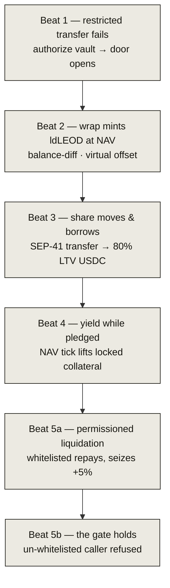

# The five-beat demo

Every beat below is a real testnet transaction *and* an integration test in the
repo. Run it yourself at **[app.leontief.tech/demo](https://app.leontief.tech/demo)**
(no wallet needed) or from the CLI with `./scripts/demo.sh`.

1. **Restricted transfer fails.** LEOD is a genuine SEP-8 asset; sending it to a
   stranger reverts. Authorizing the vault opens the door.
2. **Wrap mints ldLEOD at NAV.** The vault measures the deposit by balance
   difference and mints a composable share at the live, fail-closed NAV.
3. **The share moves freely and borrows.** Transfer ldLEOD (SEP-41), pledge it,
   and draw USDC at 80% LTV.
4. **Yield while pledged.** A NAV tick raises `share_price` — and the health factor
   of the *locked* collateral — exactly as for idle shares.
5. **Permissioned liquidation.** A whitelisted liquidator repays and seizes shares
   at a 5% bonus (**5a**); an un-whitelisted wallet is refused the identical call
   (**5b**).

Each beat prints its transaction hash; open any of them on
[stellar.expert](https://stellar.expert/explorer/testnet). Nothing here is staged —
every number is a live chain read. The recording kit is `scripts/record_demo.md`.
