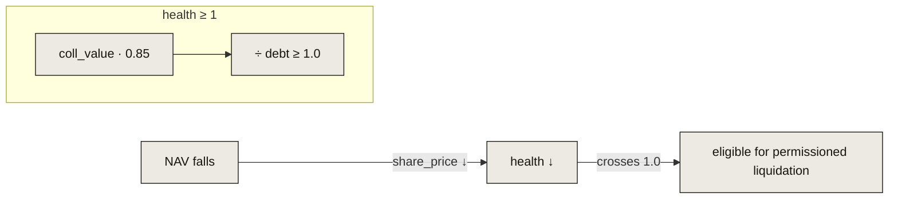

# The mini-pool

The mini-pool is a deliberately small, isolated money-market: pledge `ld-shares`,
borrow USDC, stay above a health factor of 1. It exists to prove the collateral
path end-to-end; at mainnet the same ld-share plugs into a real
[Blend](/integrations/blend) pool, and the mini-pool is relegated to
demo/liquidation-drill status.

## Risk parameters

Compile-time constants (7-decimal / bps fixed point):

| Parameter | Value | Meaning |
|---|---|---|
| `LTV` | 80% (`8000` bps) | max `debt / collateral_value` at borrow time |
| `liquidation threshold` | 85% (`8500` bps) | health-factor uses this, giving a buffer above LTV |
| `liquidation bonus` | 5% (`500` bps) | discount the liquidator seizes at |
| close factor | 50% | max fraction of debt repayable in one liquidation |

## Health factor

```
coll_value = collateral_shares · share_price / SCALE            // NAV enters once, via share_price
health     = coll_value · liq_threshold / debt                  // SCALE-scaled
```

`health_factor` returns `i128::MAX` when a position is debt-free. A position is
liquidatable when `health < 1.0` (i.e. `< SCALE`). Because `share_price` reads
live NAV, health moves with the market automatically:



## Permissioned liquidation

This is the trait that makes Leontief safe for **regulated** collateral: seizing
someone's ld-shares is gated to an allow-listed liquidator. An open, permissionless
liquidation market would let anyone end up holding a restricted asset's economic
exposure — unacceptable for compliance.

```
require is_whitelisted(liquidator)        // beat 5b: un-whitelisted caller reverts
require health_factor(user) < SCALE       // only unhealthy positions
repay ≤ debt · close_factor               // clamp to the close factor
pull USDC (balance-diff) → user.debt −= repaid
seize = ceil( repay · (BPS + bonus) / BPS · SCALE / share_price )   // ceil → protocol/liquidator
transfer seized ld-shares → liquidator
```

Seizing rounds **up** (protocol-favorable), mirroring the golden liquidation
vectors. The `liquidate` call returns the number of shares seized.

## Isolation & exits

- Each user's `Position { collateral_shares, debt }` is independent; there is no
  shared-pool contagion in the prototype.
- `repay` and `withdraw_collateral` are **never pausable** and `repay` needs no
  oracle — a borrower can always de-risk, even during an incident or oracle halt.
- `withdraw_collateral` enforces a post-condition of `health ≥ 1` (else
  `UnsafeWithdraw`).

## Entry points

| Method | Auth | Notes |
|---|---|---|
| `supply_collateral(from, shares)` | `from` | pledge ld-shares |
| `withdraw_collateral(from, shares)` | `from` | post-condition health ≥ 1; **not pausable** |
| `borrow(from, amount)` | `from` | requires `debt ≤ LTV · coll_value` |
| `repay(from, amount)` | `from` | **not pausable**, no oracle; clamps to debt |
| `liquidate(liquidator, user, repay)` | `liquidator` | whitelist-gated; returns seized shares |
| `health_factor(user)` / `position(user)` | — | reads |
| `set_whitelist(who, allowed)` | admin | grant/revoke liquidation permission |
