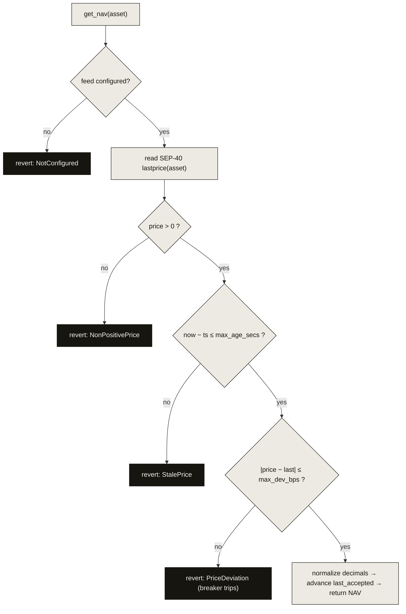

# The oracle adapter

The adapter is the single place a price enters the protocol. It consumes a
**SEP-40** feed (Reflector on mainnet; a [mock](/integrations/reflector) on
testnet for drills), normalizes it to a `SCALE`-scaled NAV, and **fails closed**:
if the price can't be trusted, pricing-dependent operations stop rather than
guess.

## The policy



Three independent guards, each a hard revert:

1. **Non-positive price** → `NonPositivePrice`. A zero or negative feed is never a price.
2. **Staleness** → `StalePrice`. `now − feed_ts` must be `≤ max_age_secs`. There is
   no "use the last one anyway" path.
3. **Deviation breaker** → `PriceDeviation`. A jump beyond `max_dev_bps` versus the
   last accepted value trips the breaker and halts, rather than propagating a
   possible manipulation or feed glitch.

On success the adapter **advances `last_accepted`** with the fully-validated data.
`get_nav` is therefore deliberately callable by anyone: callers cannot inject
values, and keeping the breaker state fresh only tightens protection.

## Normalization

The SEP-40 feed reports a price with its own decimals; the adapter converts to the
protocol's `SCALE = 10¹²` using the per-feed `source_decimals` recorded at
configuration. The conversion is unit-tested with a 10,000-case property
(round-trip, monotonic, no overflow) — see [Security](/security).

## Configuration

```rust
configure_feed(asset: Symbol, source: Address, source_decimals: u32)  // admin
set_bounds(asset: Symbol, max_age_secs: u64, max_dev_bps: u32)        // admin
get_nav(asset: Symbol) -> Result<NavData, Error>                      // anyone; fail-closed
last_accepted(asset: Symbol) -> Option<NavData>                       // read, no checks (monitoring)
feed_config(asset: Symbol) -> Option<FeedConfig>
```

`NavData { nav: i128, ts: u64 }`. `FeedConfig { source, source_decimals, max_age_secs, max_dev_bps }`.

The mainnet `max_age_secs` is calibrated to the feed's cadence ×2.5 — for Reflector
Pulse's 300 s heartbeat that is **750 s**. See the
[Reflector integration](/integrations/reflector) for the exact live values.

:::warning Prototype escape hatch
The adapter ships an admin `accept_override(asset, nav)` that re-arms a halted
feed by planting a new `last_accepted`, so testnet deviation-breaker drills can
recover without a redeploy. It emits a loud `override_accepted` event that
monitoring treats as an incident. At mainnet it is exercised only via multisig and
is a candidate for removal/timelock — recorded as Decision #2.
:::
