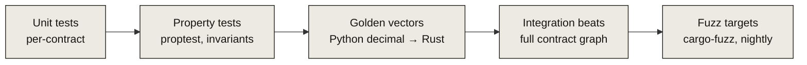

# Security & testing

Leontief holds user funds, so the bar is: **every row in the threat model maps to
a named, passing test.** Zero untested rows. The suite is 98+ tests across unit,
property, integration, golden-vector, and fuzz layers.

## Verification layers

- **Unit** — each contract's entry points, typed errors, auth.
- **Property** ([proptest](https://proptest-rs.github.io/proptest/)) — accounting
  fairness, round-trip `≤` deposited, inflation-attack bound, liquidation rounding
  and termination. Case counts scale from CI to nightly (Decision #4).
- **Golden vectors** — a Python `decimal` generator emits JSON expected values; a
  Rust loader asserts the contracts reproduce them byte-for-byte. The
  [`@leontief/sdk`](/sdk) previews are asserted against the *same* file, so client
  math can't drift from chain math.
- **Integration beats** — the [five beats](/architecture#flow-4--liquidate-permissioned)
  run against the full contract graph with a real SEP-8 restricted asset.
- **Fuzz** — two `cargo-fuzz` targets (vault sequences, pool sequences) run in the
  nightly workflow.

## Threat tie-out (excerpt)

| Threat | Defense | Named test |
|---|---|---|
| First-depositor inflation | virtual offset `VIRT`, zero-share revert | `inflation_attack_bounded` (property) |
| Caller lies about amount sent | balance-diff around every transfer-in | `deposit_measures_balance_diff` |
| Stale / manipulated price | fail-closed staleness + deviation breaker | `get_nav_rejects_stale`, `override_rearms_after_deviation_halt` |
| Depositor loses value at NAV ≠ 1 | value-consistent legs (Decision #3) | golden vault vectors, `deposit_fair_at_nav` |
| Unauthorized liquidation | whitelist gate | beat 5b, `liquidate_requires_whitelist` |
| Liquidation drains a healthy user | `health < 1` guard + close factor | `liquidate_only_unhealthy` |
| User trapped during incident | exits never pausable | `withdraw_works_while_paused`, `repay_needs_no_oracle` |
| Rounding leaks value to users | floor → user, ceil → protocol | golden vectors across both legs |

The full matrix lives in `SECURITY-TESTING.md` in the repo.

## Golden vectors {#golden-vectors}

The generator (`tests/fixtures/golden_gen.py`) computes every expected value in
Python's arbitrary-precision `decimal`, writes `golden.json`, and both the Rust
contracts and the TypeScript SDK assert against it. This is what guarantees the
three surfaces — spec, contract, SDK — agree to the integer.

## Gates & disclosure

- **CI gate:** `just check` must be green — `fmt`, `clippy -D warnings`, tests, and
  a coverage floor of **≥ 90% lines** on the funds-holding contracts (currently
  ~95.8%). Red CI never merges.
- **Toolchain pinned:** `soroban-sdk 27.0.0`, `rustc 1.97.1`, `wasm32v1-none`;
  never bumped unasked.
- **Disclosure:** coordinated, 90-day, `security@leontief.app`. A loss-of-funds
  report goes straight to the pause playbook — deposits can be halted within the
  hour, and **exits are never paused**.
