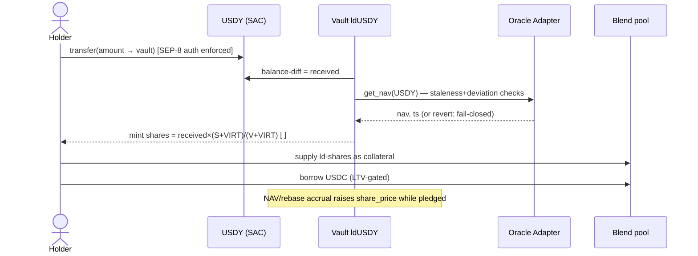

# Leontief — Unified Documentation Hub (GitBook seed)
This file seeds the public GitBook required by SCF Open Track ("a unified source containing all project development documentation"). Each `##` becomes a GitBook page. Pair with `leontief-prototype-spec.md` (frozen build spec) and `leontief-litepaper.md`.

---

## 00 · Index / Table of contents

Overview (litepaper) · Architecture · Protocol Spec v1 (mainnet delta) · Security & Threat Model · Test & Verification Plan · Operations Runbook · Open-Source & Licensing · Decisions Log (`DECISIONS.md`) · Roadmap & Tranches · UI/UX (landing + dApp prototypes) · Contributing

## 01 · Architecture

### Component diagram
```mermaid
flowchart LR
  subgraph Issuers["RWA issuers (SEP-8 / SEP-57)"]
    A1[USDY · Ondo]
    A2[CETES/USTRY · Etherfuse]
  end
  subgraph Leontief["Leontief protocol (Soroban)"]
    F[Vault Factory]
    V1[Vault ldUSDY]
    V2[Vault ldCETE]
    OA[Oracle Adapter<br/>fail-closed SEP-40]
    LQ[Permissioned Liquidation<br/>whitelist · close factor]
  end
  subgraph Oracles
    R[Reflector]
    RS[RedStone]
  end
  subgraph Venues
    B[Blend pool<br/>ld-share collateral]
    AQ[Aquarius<br/>ld-share LP]
  end
  U[Holder wallet<br/>Freighter / passkey]
  L[Whitelisted liquidator]

  A1 -->|deposit via SAC| V1
  A2 -->|deposit via SAC| V2
  F -->|deploys| V1 & V2
  R & RS --> OA --> V1 & V2
  V1 & V2 -->|mint ld-shares| U
  U -->|collateral| B
  U -->|LP| AQ
  B -->|distress| LQ
  L -->|seize (whitelist-gated)| LQ
```

### Deposit → borrow sequence


### Permissioned liquidation sequence
```mermaid
sequenceDiagram
  actor L as Liquidator
  participant P as Pool
  participant W as Whitelist
  participant V as Vault
  L->>P: liquidate(user, repay)
  P->>W: is_whitelisted(L)?
  alt not whitelisted
    P-->>L: revert NotWhitelisted (demo beat 5b)
  else whitelisted
    P->>P: require hf<1; repay ≤ close factor
    P->>V: value shares (share_price × nav)
    P-->>L: seize shares ×(1+bonus) — protocol-favoring rounding
  end
```

### Design decisions (rationale on record)
1. **Vault = share token** (4626-style): fewer cross-contract auth hops, smaller audit surface.
2. **Fail-closed oracle**: stale/deviant NAV halts pricing-dependent ops; never a silent fallback. Direct answer to Stellar's 2026 oracle-manipulation incident class.
3. **Virtual-share offset + balance-diff accounting**: closes inflation/donation attacks and handles rebase timing in one mechanism.
4. **MiniPool for prototype, Blend for mainnet**: deterministic demo first; production credit stays with the incumbent.
5. **Fee switch present, OFF at launch**: audit and launch narrative stay clean; activation is a governance event, not a redeploy.

## 02 · Protocol Spec v1 — mainnet delta (beyond frozen prototype spec)

- **Blend integration** replaces MiniPool as the credit venue: ld-shares listed as reserve in a dedicated Blend pool; Leontief ships the price adapter Blend consumes (share_price × NAV composition, same fail-closed policy).
- **Aquarius path**: ld-share/USDC pool; LP guide + router helper in SDK.
- **Liquidation Tier-2 (redemption unwind)**: on Tier-1 timeout, protocol redeems underlying with issuer at NAV and repays debt from proceeds — requires per-issuer redemption adapter (Etherfuse first); Tier-3 (issuer backstop) remains a documented manual procedure with signed issuer runbook.
- **SEP-57 module (permissioned era)**: share-holder gating hook per asset (identity-registry check on transfer), enabling BENJI-class assets; designed now, shipped post-mainnet.
- **Fee module**: `fee_bps` accrued into share-price spread; hard-capped at 50 bps in code; OFF (0) at launch; two-step timelocked activation.
- **Admin & governance**: 2-of-3 team multisig at launch → add 48h timelock on parameter changes at Tranche-3 + one external signer within 90 days of mainnet; full param-change event log.
- **Caps policy**: per-asset cap = min($500K launch, 10% of asset's Stellar float, 25% of documented weekly redemption capacity).

## 03 · Security & Threat Model (audit-readiness for Audit Bank)

**Assets at risk:** user-deposited RWAs in vaults; ld-share integrity; pool solvency.
**Trust assumptions:** issuer honesty on NAV inputs bounded by deviation checks; SEP-40 providers; Soroban runtime (no reentrancy today — defensively ordered anyway); team multisig.

| Threat (STRIDE-ish) | Vector | Control |
|---|---|---|
| Share inflation attack | first-deposit front-run + donation | virtual offset (10³) both legs; donation test in CI |
| Accounting drain | rounding direction abuse | floor-to-user / ceil-to-protocol invariant + proptest round-trips |
| Oracle manipulation / staleness | bad or stale NAV | fail-closed adapter: max_age 25h, 200 bps/update deviation bound, halt-not-guess; caps sized to worst-case mispricing |
| Rebase timing games | deposit around rebase tick | balance-diff measurement at transfer boundaries |
| Unlawful collateral seizure | non-whitelisted liquidator | whitelist gate + rejection path tested (`beat_5b`) |
| Issuer freeze/clawback | SEP-8 `auth_revocable` action | per-vault isolation; circuit breaker pauses vault only; exits (withdraw/repay) never paused |
| Admin key compromise | multisig member loss | 2-of-3, hardware keys, timelock at T3, published runbook |
| Governance rug perception | fee/param abuse | hard-coded fee cap, timelock, event log, tokenless (no vote capture) |
| Frontend phishing | clone sites | leontief.app HSTS domain policy; contract addresses pinned in docs; wallet-warning integrations |

**Invariants (enforced in tests, restated for auditors):** share_price non-decreasing absent accepted NAV decrease · Σ user claims ≤ vault holdings + dust · deposit→withdraw round-trip ≤ deposited · pledged shares accrue identically to idle shares · pool never under-compensated by rounding.

**Disclosure policy:** security@ contact + 90-day coordinated disclosure; no bug bounty pre-revenue (stated honestly), critical-report fast lane via multisig pause.

## 04 · Test & Verification Plan

Unit per contract → property (`proptest`: round-trips, rounding direction, hf monotone in NAV) → integration `beat_1..beat_5b` mirroring the public demo → fuzz harness on accounting entry points → coverage gate ≥90% core (`cargo llvm-cov`, CI artifact) → testnet drills: oracle-deviation breaker, vault pause, liquidation both paths, fresh-account full redeploy (`setup_testnet.sh`) before every tranche report → mainnet: shadow monitoring 2 weeks on caps before raising.

## 05 · Operations Runbook

**Deploy:** tagged release → `stellar-cli` deploy → address registry commit → verify → announce.
**Monitoring:** indexer alerting on share_price discontinuity (>25 bps step), oracle staleness, hf distribution, cap utilization; on-call rotation of 3.
**Pause playbook:** trigger criteria (oracle halt >6h, issuer action, invariant alarm) → multisig pause(vault) → status page + Discord notice ≤1h → post-mortem in DECISIONS.md ≤72h. Exits never paused.
**Key management:** 3 hardware wallets, geo-separated; recovery doc sealed with studio; signer change = KYC re-verification trigger acknowledged (SCF rule).
**Tranche cadence:** internal deadline = SCF deadline − 14 days; delay email template ready (silence = forfeiture — never go silent).

## 06 · Open-Source & Licensing

Public repo from first commit under the team's org. Contracts: Apache-2.0 (at mainnet latest). SDK/indexer: MIT. Docs: CC-BY-4.0. Landing/brand assets: proprietary to 29Projects Lab. Third-party code inventoried in `NOTICE`.

## 07 · DECISIONS.md convention

Append-only. Entry = date · author (human) · decision · alternatives · spec sections affected · test impact. Required for any deviation from frozen spec §3 math, §5 oracle policy, §7 security checklist. This file is an audit input and part of the AI-assistance discipline (every AI-assisted deviation gets a human-authored entry).

## 08 · Roadmap & tranche map

Mirror of the SCF submission §4 (single source of truth: the submission; this page links, never restates numbers).

## 09 · UI/UX

Cinematic landing (dormant→awake concept) · dApp (markets, deposit/mint, borrow, positions, health) · liquidator console · issuer panel — live links + Claude Design system reference for new assets.

**Live (testnet):**
- dApp — https://leontief-app.vercel.app (guided 5-beat demo at `/demo`)
- Landing — https://leontief-landing.vercel.app
- Litepaper — https://leontief-landing.vercel.app/Litepaper.dc.html
- Testnet contract registry — `deployments/testnet.json`; deploy how-to in `docs/DEPLOY.md`, app details in `docs/APP.md`.
